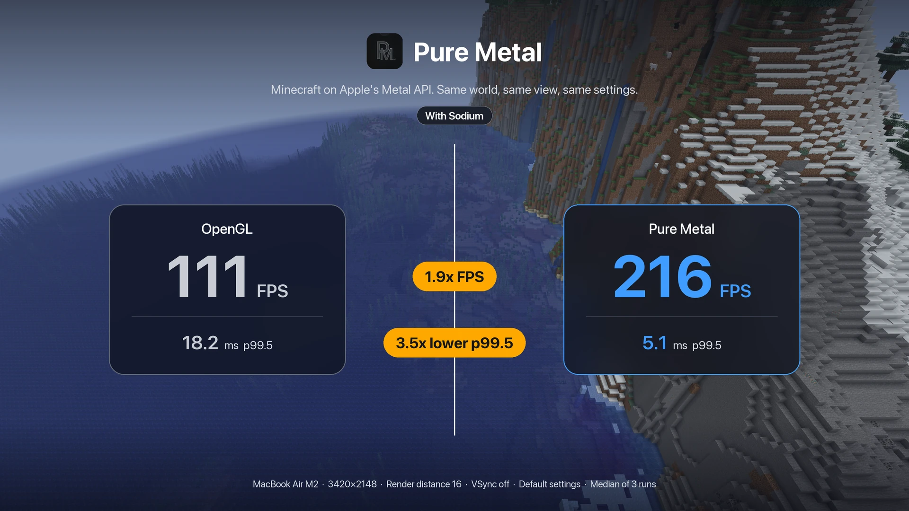

# Pure Metal

A native Metal renderer for Minecraft on Apple Silicon Macs. Same visuals as vanilla, rendered through Apple's Metal API instead of OpenGL. Works with Sodium.

- Fast Terrain renders terrain much faster on the GPU, on by default (macOS 15+)
- Smoother Chunk Loading paces background chunk builds, finishes terrain uploads between frames (without Sodium) and boosts sound thread priority, on by default
- Terrain LOD simplifies distant terrain, leaves, plants and water at render distance 16+
- Optional Render Scale with temporal upscaling and an Auto mode
- Faster World Generation limits FPS while nearby chunks are missing (optional, singleplayer)
- Battery Saver caps FPS at 60 (30 FPS while your Mac is hot) to save power and heat (optional)
- HDR Highlights make the sun, bright sky, lava and glowing blocks brighter on Mac screens with HDR headroom, without boosting menus or the HUD; toggles live without restarting (optional)
- Smooth Frame Pacing with VSync shows frames at an even pace (optional)
- Experimental Metal 4 mode (macOS 26+)
- With VSync off, Minecraft can render at a higher FPS without screen tearing by default
- Distant Horizons support on Fabric, on by default (tested on DH 3.3.4, other 3.3.x run as untested when the key classes match 3.3.4)
- A Pure Metal line on the F3 screen for bug reports, including Fast Terrain status and native F3 GPU % timing



## Performance

*Measured on Pure Metal 0.4.5 with its default settings. MacBook Air M2 (fanless), render distance 16, VSync off, no FPS cap. Every run starts at the same spot and view: 8 seconds of warm-up, then 20 seconds measured. Medians of 3 runs in alternating order.*

**With Sodium (fullscreen 3420x2148)**

| Renderer | Avg FPS | 1-in-50 slowest frame (p98) |
| --- | --- | --- |
| Pure Metal | <strong>216</strong> | <strong>5.0 ms</strong> |
| OpenGL | 111 | 14.2 ms |

**Without Sodium (fullscreen 3420x2148)**

| Renderer | Avg FPS | 1-in-50 slowest frame (p98) |
| --- | --- | --- |
| Pure Metal | <strong>147</strong> | <strong>7.1 ms</strong> |
| OpenGL | 58 | 25.0 ms |

**Pure Metal vs mcopt (1920x1080)**

*mcopt runs without Sodium, since the two are incompatible.*

| Renderer | Avg FPS | 1-in-200 slowest frame (p99.5) |
| --- | --- | --- |
| Pure Metal + Sodium, 50% scale | <strong>453</strong> | <strong>3.0 ms</strong> |
| mcopt | 438 | 3.2 ms |
| Pure Metal + Sodium | 352 | 3.3 ms |
| Pure Metal | 216 | 5.0 ms |
| OpenGL (no Sodium) | 60 | 23.7 ms |

**Pure Metal on different Macs (more coming soon)**

*Minecraft 26.3, no Sodium, render distance 16, fullscreen at each Mac's native resolution, VSync off, no FPS cap. M2 ran at 50% LOD, others at the default. Same seed and flight route for all: a warm-up lap, then 30 seconds measured. Results other than M2 Air and M5 Air were provided by third-party testers.*

| Mac | Pure Metal | Avg FPS | 1-in-100 slowest frame (p99) | 1-in-1000 slowest frame (p99.9) |
| --- | --- | --- | --- | --- |
| M5 Max, 48 GB | 0.4.5 | <strong>1043.4</strong> | <strong>1.4 ms</strong> | <strong>3.2 ms</strong> |
| M3 Max, 36 GB | 0.4.5 | 669.3 | 2.7 ms | 5.6 ms |
| M5 Air, 24 GB | 0.5.3 | 337.9 | 5.2 ms | 9.7 ms |
| M2 Air, 16 GB | 0.4.5 | 200.7 | 8.9 ms | 15.0 ms |
| M1 Air, 8 GB | 0.4.5 | 182.2 | 10.1 ms | 22.4 ms |

**[Benchmark your Mac](docs/BENCHMARKING.md#benchmark-your-mac)**

## Requirements

- macOS 14 or newer on Apple Silicon (tested on M2). Fast Terrain needs macOS 15. The optional Metal 4 mode needs macOS 26.
- Minecraft 26.3 with Fabric or NeoForge
- Java 25 (ARM64 / Apple Silicon build, not Intel/Rosetta)
- Sodium (optional)

## Install

Download the Fabric or NeoForge jar from the [releases page](https://github.com/imCinq/Pure-Metal/releases) and put it in your `mods` folder. Leave Graphics API on Default. Find Pure Metal settings in Video Settings or on its page in Sodium.

## Fast Terrain

On by default, needs macOS 15. Terrain renders much faster on the GPU and looks the same.

- **Benefit:** the GPU does about half the work per frame. On a MacBook Air M2 at fullscreen, FPS went from 157 to 294 with Sodium and from 86 to 154 without it, measured with Fast Terrain switched on and off in the same session at the same spot.
- **Resource packs:** if a pack or mod changes the terrain shaders, Fast Terrain turns off on its own. Remove the pack and it comes back.
- **Status:** the F3 screen and Pure Metal's settings show `Fast terrain: On` or `Off`.

To turn it off, see [JVM options](#jvm-options).

## Smoother Chunk Loading

On by default. Keeps FPS steady while flying or exploring without Sodium, especially on fanless MacBook Airs.

- **Chunk pacing:** scales background chunk builds to your Mac's cores and temperature so sudden terrain bursts don't cause stutters. Turns off during loading screens so worlds load at full speed.
- **End-of-frame uploads:** finishes terrain uploads between frames instead of mid-frame, avoiding extra GPU work before the HUD.
- **Sound priority:** keeps sound playback from causing brief hitches when the CPU is busy (works with and without Sodium).

*Sodium already handles its own chunk building and uploads, so only the sound improvement runs alongside it.* To turn any of these off, see [JVM options](#jvm-options).

## Render Scale

Optional, off by default. Draws the 3D world at fewer pixels and scales it up. Menus, chat and the HUD stay sharp.

- **Render Scale:** Native, or 50 to 100%. Since 0.5.0 the upscale is merged into the next pass, so lower scales cost less extra work.
- **Auto Render Scale:** off by default. Lowers the scale when your GPU can't reach your FPS target and raises it when it can (100, 85, 70 or 60%). If a lower step doesn't make the game faster, it goes back up and waits before trying again.
- **Upscaler:** Bilinear (fastest), MetalFX Spatial (sharper) or MetalFX Temporal (sharpest, steadiest image below 100%).

## More options

- **Terrain LOD** (on at render distance 16+): simplifies distant terrain, leaves, plants and water.
- **F3 screen:** shows the renderer, GPU, render scale, Fast Terrain, HDR status and the Distant Horizons path.

Miscellaneous:
- **Faster World Generation** (singleplayer): caps FPS while nearby chunks are still loading, so they build faster.
- **Battery Saver:** caps FPS at 60, or 30 while your Mac is hot.
- **HDR Highlights:** makes the sun, bright sky, lava and glowing blocks brighter than normal white on screens with HDR headroom, without boosting menus or the HUD. Toggles live without restarting, and turns itself off on screens without HDR and while Battery Saver is on.
- **Smooth Frame Pacing** (needs VSync): shows frames at an even pace.

Experimental:
- **Metal 4** (macOS 26): Metal 3 is currently faster.
- **High Refresh Boost** (200 Hz+ displays, VSync off): shows frames as soon as they are ready. May tear.

## Distant Horizons

**Distant Horizons** support is on by default on **Fabric**. DH **3.3.4** has been visually tested and 3.3.3 was checked in Loom. Other 3.3.x versions whose key classes match 3.3.4 also run, with an "untested version" note in F3 and a log warning. Keep DH's rendering engine on **AUTO**. Distant terrain may take time to generate.

On NeoForge, or with an unsupported DH version (including 3.3.x versions whose checked classes differ, or 3.2, 3.4, 4.x and so on), Pure Metal falls back to the normal backend and doesn't use Metal while DH is installed. To turn the support off, see [JVM options](#jvm-options).


## Known limitations

- Iris and other shader mods are not supported, including together with Distant Horizons.
- Metal 4 is optional and off by default. Metal 3 is the recommended mode and is currently the faster one.
- Pure Metal is an independent project and is not affiliated with Mojang, Microsoft or Apple.

## JVM options

Add these to your launcher's JVM arguments and restart.

| Option | Effect |
| --- | --- |
| `-Dpuremetal.fastTerrainMath=off` | Turns Fast Terrain off |
| `-Dpuremetal.experimentalDistantHorizons=false` | Turns Distant Horizons support off (`FALSE` and `False` also work) |
| `-Dpuremetal.disableChunkBuildPacer=true` | Turns chunk-build pacing off (without Sodium) |
| `-Dpuremetal.maxChunkBuildThreads=N` | Sets a fixed chunk-build worker limit instead of automatic pacing |
| `-Dpuremetal.disableEarlyTerrainUpload=true` | Turns end-of-frame terrain uploads off (without Sodium) |
| `-Dpuremetal.disableThreadQos=true` | Turns sound thread priority boost off |

With Distant Horizons support off, the game runs without Metal while DH stays installed. To keep Metal without DH, remove the DH mod instead.

## Build from source

```
./gradlew build
```

Needs Xcode 26 or newer, or its command line tools (the Objective-C bridge is built with the system `clang` against the macOS 26 SDK; the result still runs on macOS 14+) and a Java 25 toolchain. The Fabric jar ends up in `build/libs` and the NeoForge jar in `neoforge/build/libs`.

Developer benchmarks (`tools/bench.py`) and building the benchmark JAR (`./gradlew benchmarkJar`) are in [docs/BENCHMARKING.md](docs/BENCHMARKING.md).

## Docs

- [Design notes](docs/DESIGN.md)
- [Benchmarking](docs/BENCHMARKING.md)
- [Changelog](CHANGELOG.md)

## Issues

Bug reports go to the [issue tracker](https://github.com/imCinq/Pure-Metal/issues). Include the Pure Metal line from F3 and `latest.log`.

## License

Apache License 2.0, see [LICENSE](LICENSE).
